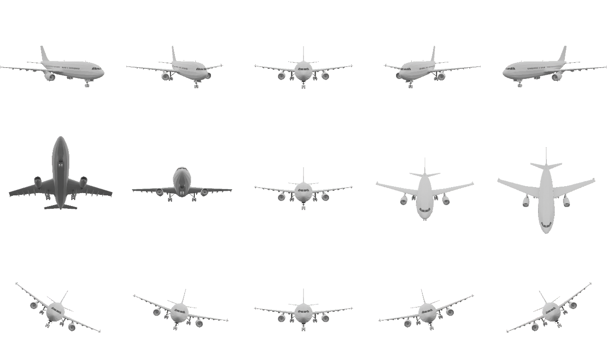
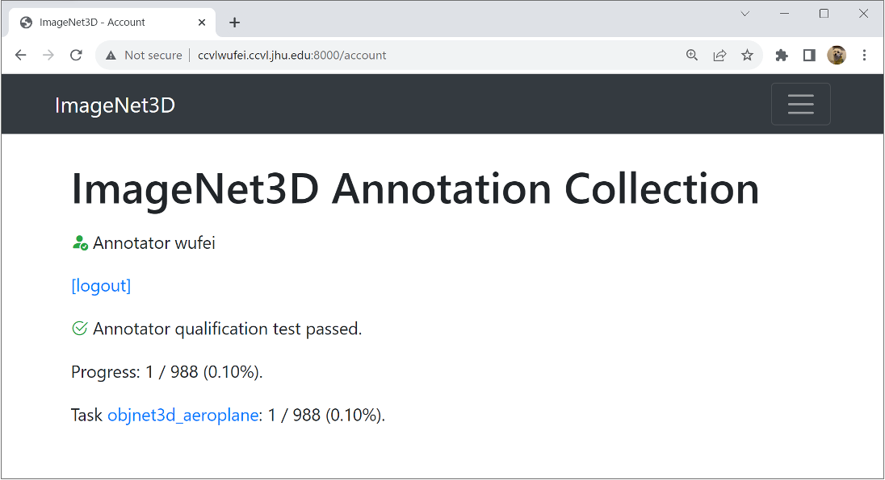
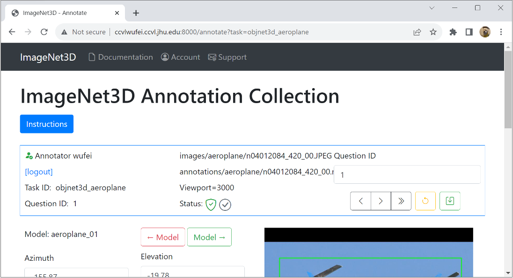
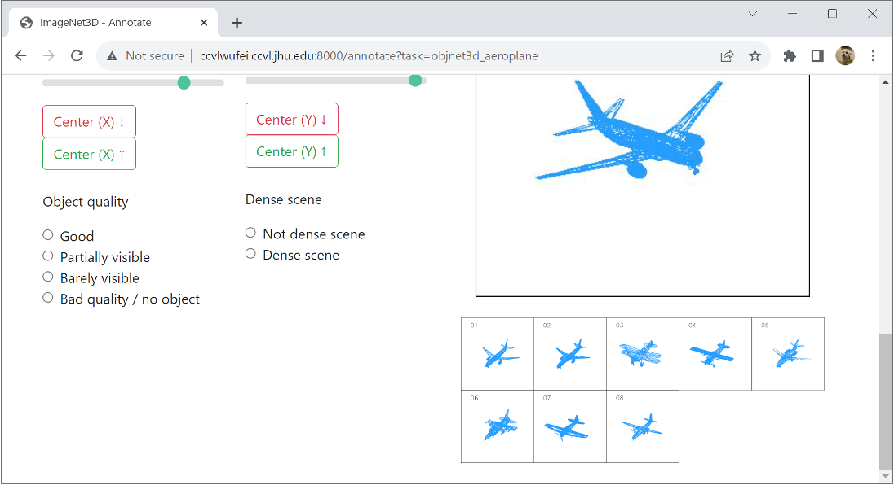
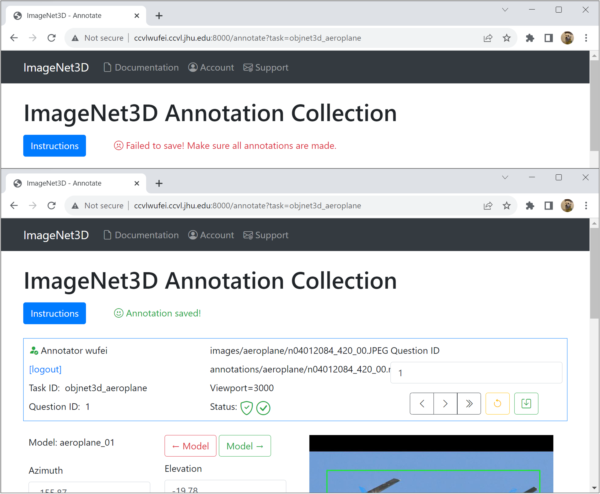

# 🖼️ImageNet3D Flask app
## 📖使用软件注意事项以及解决方法
### 📦启动程序前所需安装的包：

- Flask  
- numpy  
- matplotlib  
- pillow  
- opencv-python-headless  
- flask-login  
 

使用时会在当前目录创建imagene3dstorage文件夹，  
在此文件夹的下一层目录中会有空的sqlite且字节为0的文件，  
可将内容替换为软件根目录下的‘daatabasse_default.ssqlite’的内容即可正常使用。  
如对替换所需的软件感到困惑，可使用软件‘Navicat Premium’进行替换。  

## 📓概述

在上一个任务中，我们研究了由扩散模型生成的带有伪 3D 标注的合成图像<a href="#ref1">[1]</a>。我们发现约 75% 的合成图像与伪 3D 标注一致，而其余 25% 的图像存在视角或形状不一致的情况。尽管作为合成数据集存在一些噪声，但我们已经证明，NMMs<a href="ref2">[2]</a> 能够有效地从“良好”的样本中学习，并在分布内和分布外的数据上提升性能。 

这为 3D 理解（例如，定位、检测、分割）开辟了许多新的机会——模型可以基于现有 LLM 和生成扩散模型所学到的知识来构建。然而，为了分析此类模型的性能，我们仍需开发一个具有准确 3D 标注的数据集，以评估这些模型的零样本/少样本性能。 

**我们如何描述三维空间中的一个物体？** 在这个项目中，我们指明物体的三维视角（见下图），物体在图像平面中的二维位置以及相机到物体的距离。这六个参数能够让我们完整地确定物体的三维位置和三维旋转。此外，我们还对图像中的物体属于哪种子类型感兴趣——如果它是汽车，是轿车还是掀背车。这是通过将物体与给定模型列表中的最佳匹配网格模型相关联来实现的（您将在注释页面的右下角看到所有可用的网格模型）。 

最后，每张真实图像都附带有一个来自预训练 3D 模型的现有注释。您的工作是完善模型的预测，并标注物体的质量。请参见下面每张真实图像的“待办事项”完整列表。 

**❗阅读我 ☺ → 在开始之前，您务必仔细阅读本[教程](https://drive.google.com/file/d/1BiQ4CoYbhABI5S2oC0M7IGqqvUmosnmu/view)，其中包含许多重要细节的定性示例。教程的第一部分与本文档类似，第二部分提供了大量定性图片。请仔细查看第二部分中的多个示例，以确保您完全理解其理念。**  

 

## ⚙️v2 版本更新（2024 年 3 月）
1.随着我们开始处理更具挑战性的类别，对于 3D 方向的初始设置不再理想。新增了带有“↓↓”和“↑↑”的按钮，这意味着它们是步长更大的粗调按钮。 

2.由于初始设置不佳，标注一张图片可能需要更长时间。请耐心等待，并确保结果在视觉上是正确的。 

3.图片质量也可能较低——一些边界框可能与感兴趣的类别不对应。因此，标注并忽略“不良”对象非常重要。将问题标记为“质量差/无对象”，这样我们会忽略此样本。在这种情况下，您可以跳过调整其他参数。 

4.与之前类似，标注可见性和场景密度仍然很重要。如果您已经完成了[教程](https://drive.google.com/file/d/1BiQ4CoYbhABI5S2oC0M7IGqqvUmosnmu/view)，应该对如何标注这些问题有很好的感觉。 

### 🎨其他类别特定的注意事项： 

- **双人自行车：** 我们没有双人自行车的良好网格模型，所以我们将使用普通自行车的网格模型。只要您在图像中的双人自行车的 2D 中心和 3D 方向与渲染的网格模型相匹配，这就不应成为问题。 
- **烧杯：** 烧杯有不同的子类型，但我们没有涵盖每种形状的良好网格模型。对于这里考虑的姿势参数，这不会成为问题。对于 3D 视点，请匹配烧杯缺口的方向。2D 位置和距离也应该很简单。 
- **双簧管：** 几乎不可能判断双簧管的“方位角”。只需忽略此参数并匹配其他参数。 
- **拐杖：** 拐杖有不同的类型（见[此处](https://www.physio-pedia.com/File:Types_of_crutches.jpg)）。我们只想要与我们拥有的网格模型匹配的类型（即腋下拐杖）。对于其他类型的拐杖，请将其标记为“质量差/无对象”。 
- **沙袋：** 沙袋有不同的类型（见[此处](https://img2.storyblok.com/1800x743/filters:focal(null):format(webp)/f/115220/2400x990/eae71daccc/how-to-choose-the-right-punching-bag-for-your-workout.jpeg)）。我们只想要拳击袋和悬挂袋，呈圆柱形。对于沙袋，也忽略“方位角”参数。 

## 🤖用户界面
使用您的注释员 ID 登录网络应用程序。您将在此页面看到分配给您的任务列表，并跟踪您的进度。 

点击一项任务将跳转至第一个未标注的问题。在顶部您会看到有关此问题的基本信息以及多个控制按钮。将鼠标悬停在按钮上会显示它们的功能。 

- 使用“<”、“>”或“>>”在问题之间切换。 
- 点击黄色的撤销按钮删除当前已保存或未保存的注释。 
- 点击绿色的保存按钮保存当前注释。（或者按“Enter”键作为快捷方式。） 

不同 CAD 模型的列表显示在底部。除了模型的 6D 姿态和类型外，您还需要回答关于物体质量和场景密度的两个问题。 

标注完所有信息后，点击绿色的“保存”按钮或按“Enter”键保存注释。如果成功，您将看到一条消息，问题状态也会亮起。 

## 🧭指南
**匹配网格模型（由预训练模型提供初始化）。** 从给定的网格模型列表中选择最佳匹配模型。这对于准确估计以下参数至关重要，因此应首先执行此操作。点击“<- 模型”和“模型 ->”按钮来更改网格模型的选择。 

**3D 旋转（由预训练模型提供初始化）。** 使用三个参数来指定对象的 3D 旋转：方位角、仰角和平面内旋转（θ）。调整这三个参数，使渲染对象的 3D 旋转与图像中对象的 3D 旋转对齐。请确保您不是简单地对齐两个对象的分割或边界。您应专注于对齐对象的 3D 旋转，使渲染对象“指向”的方向与图像中的对象相同。 

**二维位置（由预训练模型提供初始化）。** 二维位置指定了对象中心的位置。 

**距离（由预训练模型提供初始化）。** 物体与相机之间的距离。要标注距离，请确保渲染物体的“大小”与图像中物体的“大小”大致相同。 

**对象质量。** 对象质量指从图像中对象的可见清晰度。一个“好”的对象应清晰可见且未被遮挡。一个“差”的对象可能几乎看不见（比如在浓雾中驾驶时，前方车辆几乎看不见）或者被其他对象遮挡。有几种选择需要考虑： 

- 良好。图像中物体的大部分（超过 90%）清晰可见。 
- 部分可见。物体有一小部分被其他物体遮挡或位于图像之外（被图像边界截断）。 
- 几乎不可见。只有物体的一小部分清晰可见——其他部分要么被遮挡，要么位于图像之外，要么由于其他原因（例如天气）几乎不可见。 
- 质量差/无物体。物体的大部分被遮挡或位于图像之外；或者物体的姿态很难辨别。 

**密集场景。** 此参数表明一个物体是否与同一类别的另一个物体非常接近。这里“接近”是在二维图像平面中定义的——如果两个物体在二维图像平面中的距离很小，则认为它们接近。 

- 非密集场景。同一类别的物体彼此距离较远。一张图片中可以有多个同一类别的物体，但它们之间相距甚远。 
- 密集场景。物体与同一类别的另一个物体距离非常近。它们可能会相互遮挡，或者只是彼此距离很近。 

## 🌰示例
请参阅[教程](https://drive.google.com/file/d/1BiQ4CoYbhABI5S2oC0M7IGqqvUmosnmu/view)。 

## 📚参考文献

[1] [在扩散模型中添加 3D 几何控制](https://arxiv.org/abs/2306.08103)
 

[2] [基于神经特征粗到细渲染的鲁棒类别级 6D 位姿估计](https://arxiv.org/abs/2209.05624)
 
<!-- by zhuang xin jian 2205308040315 -->